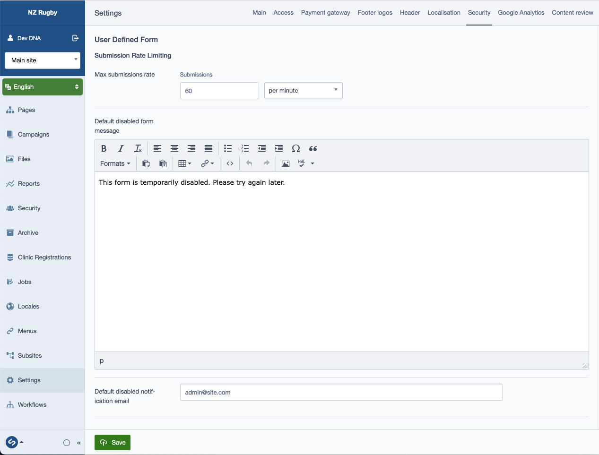
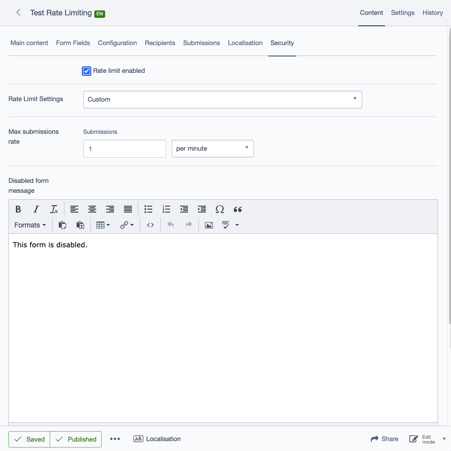
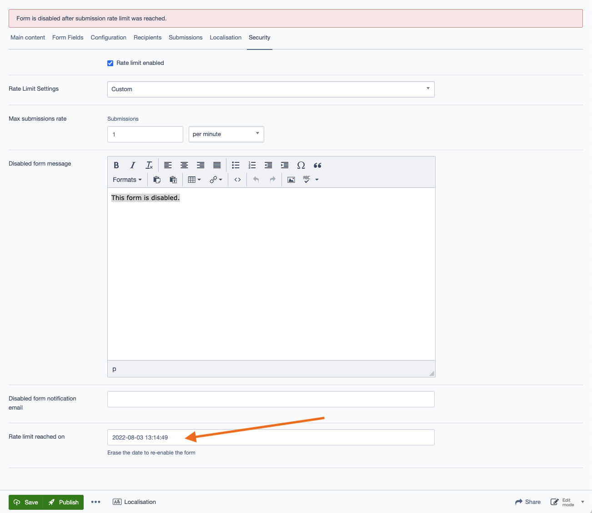

# silverstripe-user-denied-form
Prevent too many submissions being created by a Silverstripe user defined form.

## Requirements

* Silverstripe CMS ^4
* Silverstripe Userforms ^5

## Installation

```
composer require dnadesign/silverstripe-user-denied-form ^0.1
```

## Configuration
By default, any new user defined form will have rate limiting enabled.
Default parameters can be set in `Settings > Security`.

**NOTE:** even if default parameters are not explicitly set in the config,
the default rate of 60 submissions per minute will be used



All these parameters can be overwritten on each User Defined Form.
To do so, set the `Rate Limit Settings` to custom and enter the parameters.



**NOTE:** If an email address is set on the `Site Settings`, an email will be sent regardless of custom settings email address being blank. The email address can be overwritten though.

### Resetting form after rate limit has been reached

Once the limit has been reached, the form will not longer be accessible on the front-end.
By default, it will reset itself automatically after the period of time specified in the settings (1 minute by default).
If you wish to reset the form manually, you can change the config as follow:

```yaml
SilverStripe\UserForms\Model\UserDefinedForm:
  reset_rate_limit_automatically: false
```

In which case, in order to reset the form manually, edit the page, and in `Security`, erase the `Rate Limit Reached On` date and save.



## To do:
- Add an action provider to reset the form rather than having to erase the date?
- Allow multiple email address to be notified?

